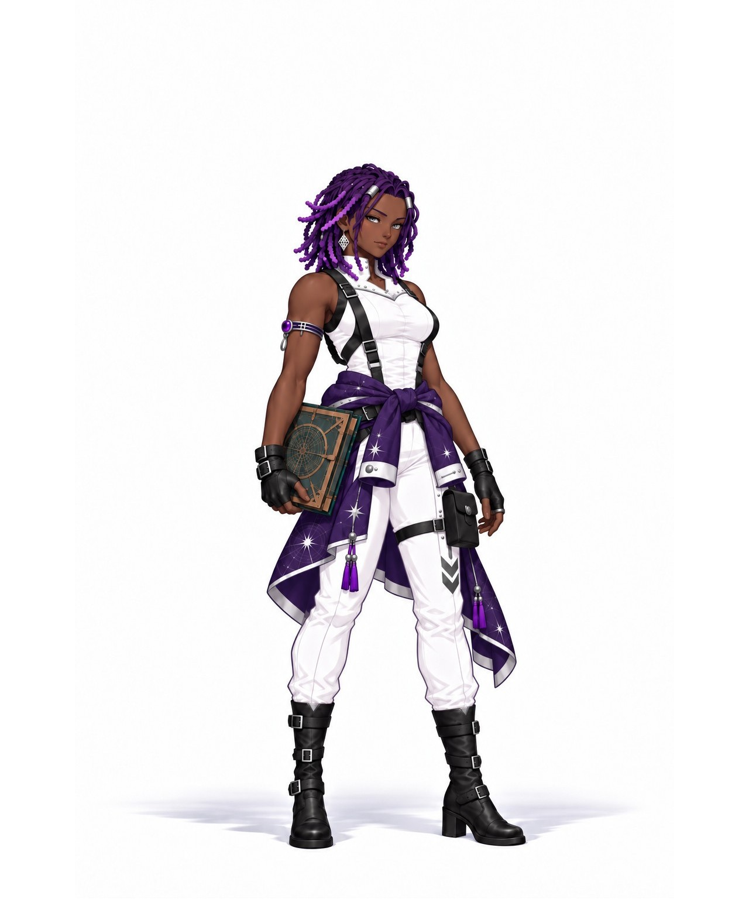

# Nimera — Current Visual Lock

**Status:** **LOCKED — EXACT SOURCE APPROVED 2026-09-22**

## Exact approved source

- exact repository master: [nimera.jpg](../../../../asset_sources/characters/current/nimera.jpg)
- native format: **JPEG/JFIF**
- dimensions: **1280 × 1536**
- size: **156104 bytes**
- SHA-256: `4e923f7053a5cc75c61c1a5deb3351743727b53d38ae57383a767a6674883874`
- set authority: [`EXACT_APPEARANCE_SOURCE_LOCK_2026-09-22.md`](EXACT_APPEARANCE_SOURCE_LOCK_2026-09-22.md)

## Pixel authority

The approved source image is the complete appearance authority. It controls face, facial proportions, hair, eyes as depicted, body proportions, clothing, armor, jewelry, equipment/props, palette, materials, silhouette, stance, scale/framing, and incidental details.

If older prose, generated-image references, repository fallback images, archived renders, or prior lock text disagree with the source, **the source wins**. Do not use prose to "correct" the image and do not combine retired details with the current source.

## Repository binary state

**Exact-byte sync: COMPLETE.**

The repository master matches the approved SHA-256 exactly. Older versions remain historical provenance only.

Do not re-encode, resize, crop, recolor, retouch, sharpen, denoise, or resave the source during promotion.

## Derivatives

Portraits, sprites, model sheets, cut-ins, promotional art, and later HD-2D/3D translations may adapt presentation for purpose, but must return to this exact source for identity. A derivative never replaces this source without new explicit approval.

Nonvisual story, biography, class, combat, and equipment mechanics remain owned by their normal numbered domains.
